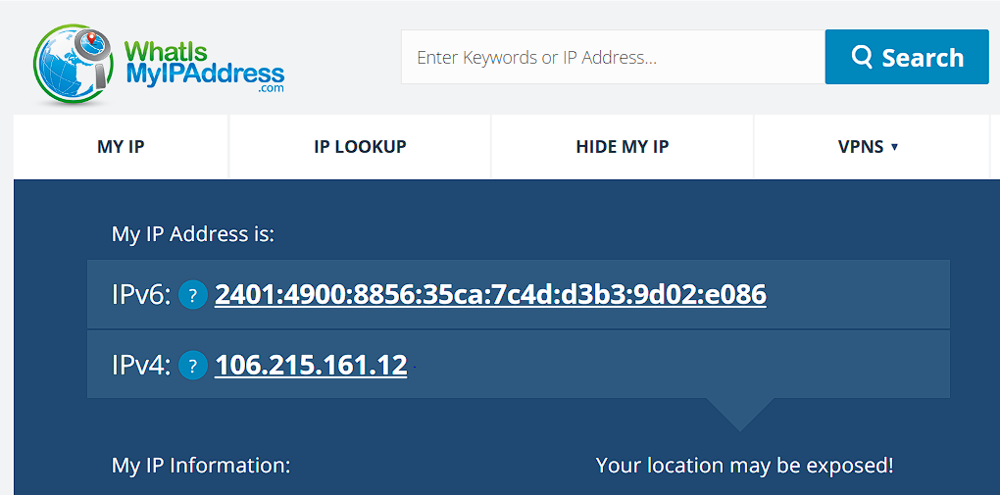
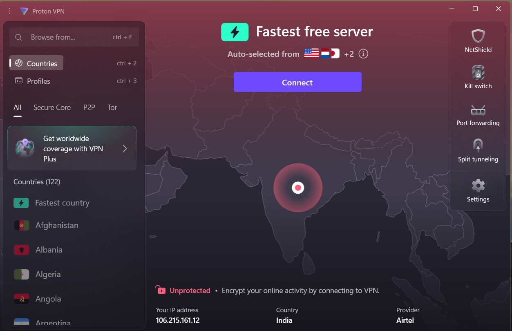
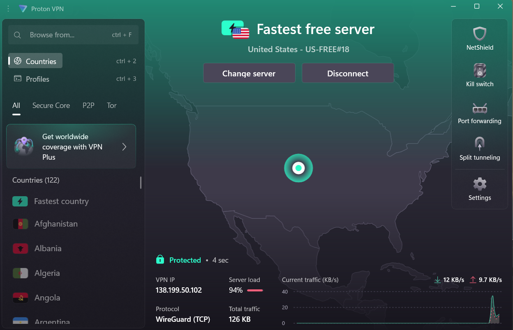
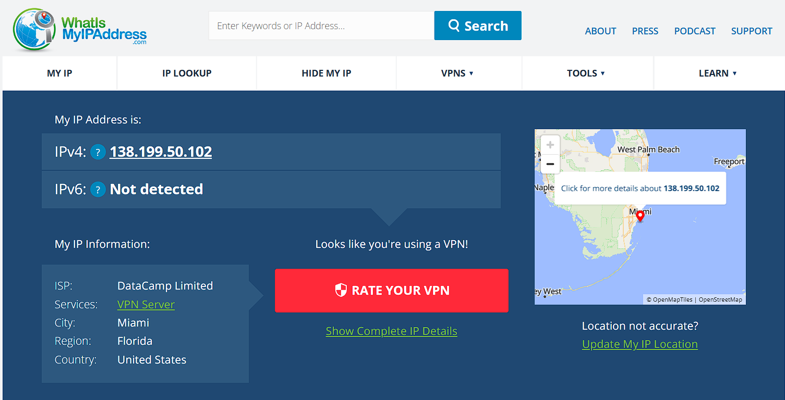

## Cyber_Internship_task8
Task 8 – Working with VPNs
# 1. Objective
Understand, set up, and use a VPN to enhance privacy and network security.

# 2. Steps Performed
   * Choose VPN: Selected ProtonVPN (free tier) as a reputable provider.

   * Installed client: Downloaded and installed the ProtonVPN desktop app.

  * Checked Initial IP Address:
       Dashboard Before Connecting:
       VPN Server (US):
       IP Address:
       Effect:

    * My IP address and location changed from India to the United States, confirming VPN is active and traffic is encrypted.

# 3. VPN Benefits and Limitations
  * Benefits:

    * Hides real IP and masks online activity

    * Encrypts internet traffic—protection on public Wi-Fi

    * Bypasses geo-blocks and censorship

 * Limitations:

   * May slow connection speed

   * Free VPNs may have usage limits

   * Does not give complete anonymity

   * VPN provider can still see your activity

# 4. Security Concepts
 * VPN: Encrypted tunnel for internet traffic; masks real IP

 * Encryption: Makes data unreadable to interceptors

 * Protocols: OpenVPN, WireGuard, IKEv2, etc.

 * Privacy: Improved but not absolute—websites may still track by cookies/fingerprint

# 5. Results
 * Successfully connected to ProtonVPN.

 * IP changed and anonymized as proven by screenshots.

 * Web traffic securely encrypted while browsing with VPN on.

# 6. Summary
VPNs are effective for privacy and security, especially on untrusted networks. Regular testing and awareness of VPN limitations are essential.
